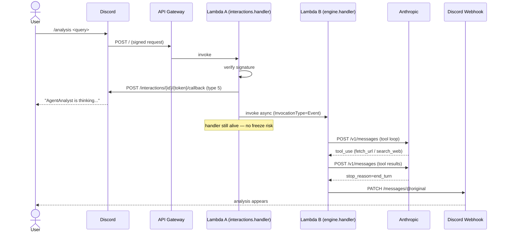
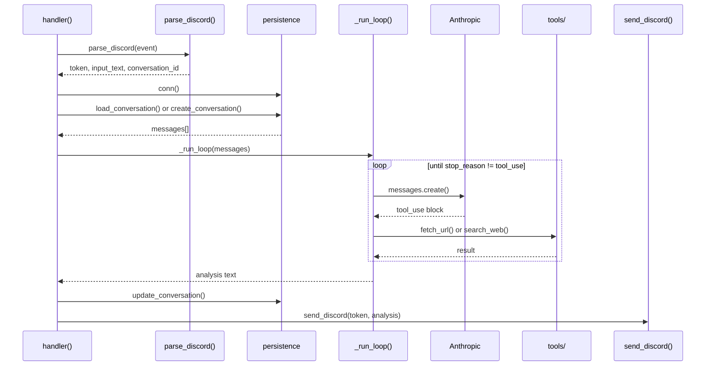

# AnalystAgent Sequence Diagrams

## Network Level

```mermaid
sequenceDiagram
    actor User
    participant Discord
    participant APIGateway as API Gateway
    participant LambdaA as Lambda A (interactions.handler)
    participant LambdaB as Lambda B (engine.handler)
    participant Anthropic
    participant Discord_Webhook as Discord Webhook

    User->>Discord: /analysis <query>
    Discord->>APIGateway: POST / (signed request)
    APIGateway->>LambdaA: invoke
    LambdaA->>LambdaA: verify signature
    LambdaA->>Discord: POST /interactions/{id}/{token}/callback (type 5)
    Discord-->>User: "AgentAnalyst is thinking..."
    LambdaA->>LambdaB: invoke async (InvocationType=Event)
    Note over LambdaA: handler still alive — no freeze risk
    LambdaB->>Anthropic: POST /v1/messages (tool loop)
    Anthropic-->>LambdaB: tool_use (fetch_url / search_web)
    LambdaB->>Anthropic: POST /v1/messages (tool results)
    Anthropic-->>LambdaB: stop_reason=end_turn
    LambdaB->>Discord_Webhook: PATCH /messages/@original
    Discord_Webhook-->>User: analysis appears
```

## Function Level (inside Lambda B)

```mermaid
sequenceDiagram
    participant Handler as handler()
    participant PD as parse_discord()
    participant DB as persistence
    participant RunLoop as _run_loop()
    participant Anthropic
    participant Tools as tools/
    participant SD as send_discord()

    Handler->>PD: parse_discord(event)
    PD-->>Handler: token, input_text, conversation_id
    Handler->>DB: conn()
    Handler->>DB: load_conversation() or create_conversation()
    DB-->>Handler: messages[]
    Handler->>RunLoop: _run_loop(messages)
    loop until stop_reason != tool_use
        RunLoop->>Anthropic: messages.create()
        Anthropic-->>RunLoop: tool_use block
        RunLoop->>Tools: fetch_url() or search_web()
        Tools-->>RunLoop: result
    end
    RunLoop-->>Handler: analysis text
    Handler->>DB: update_conversation()
    Handler->>SD: send_discord(token, analysis)
```
