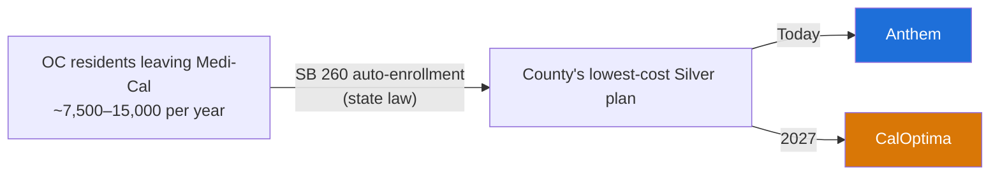

# CalOptima Enters the Orange County Exchange in 2027 — Impact on Elevance

*Executive summary · 2026-07-23 · one slide · [full report with sources and confidence levels](age-71-caloptima-oc.md)*

---

## The event

CalOptima Health — Orange County's Medi-Cal plan, 819,000 members — joins Covered California for 2027 as the county's **lowest-cost Silver plan**. Molina exits the county at the same time.

## Three numbers that matter

| | |
|---|---|
| **~7,500** | Members CalOptima captures in year 1 (range: 3,050–14,750). About 4% of the county's 170,790-member exchange market. |
| **~4,000 / ~$40M** | How much smaller Anthem's OC book ends 2027 versus a world with no CalOptima entry (3,850–4,250 members; $38–42M in annual gross premium). Anthem is the county's #2 carrier at 31% share. |
| **~$8–12M/yr** | Partial offset: our risk adjustment payments shrink, because the members we lose are our healthiest. State pool impact is negligible (<1%). |

## Why this is bigger than a new competitor

**State law hands CalOptima our best acquisition channel.** SB 260 automatically enrolls everyone leaving Medi-Cal into the county's cheapest Silver plan. That default is **Anthem today**. In 2027 it becomes CalOptima — the pipeline transfers by law, not by competition.

Two aggravators:
- Auto-assigned members **keep their CalOptima doctors**, so more of them will activate coverage than do under today's Anthem default.
- A new cheapest Silver can lower the subsidy benchmark, **raising net premiums for roughly half of our OC members** even if our rates don't change.

## What to watch — October 2026

Final 2027 rates publish this fall. Two questions decide severity: **how far below the market CalOptima prices**, and **whether Anthem stays second-lowest Silver** (which would keep us as the subsidy benchmark). Re-analysis is scheduled against that release.

---

*Baseline figures are verified against primary sources (Covered California enrollment file, CMS risk adjustment data). Projections are modeled ranges, not measurements — full per-claim sourcing in the [full report](age-71-caloptima-oc.md).*
