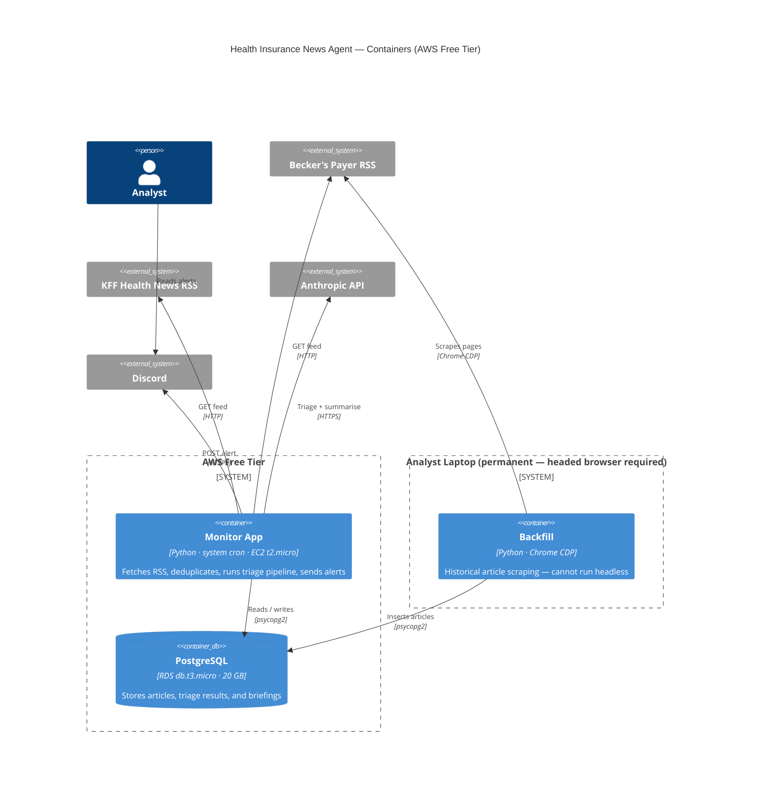
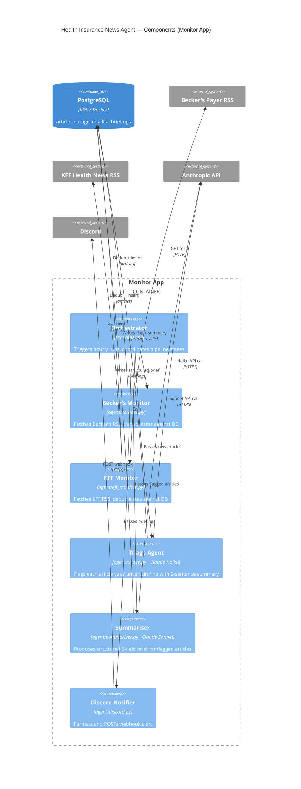
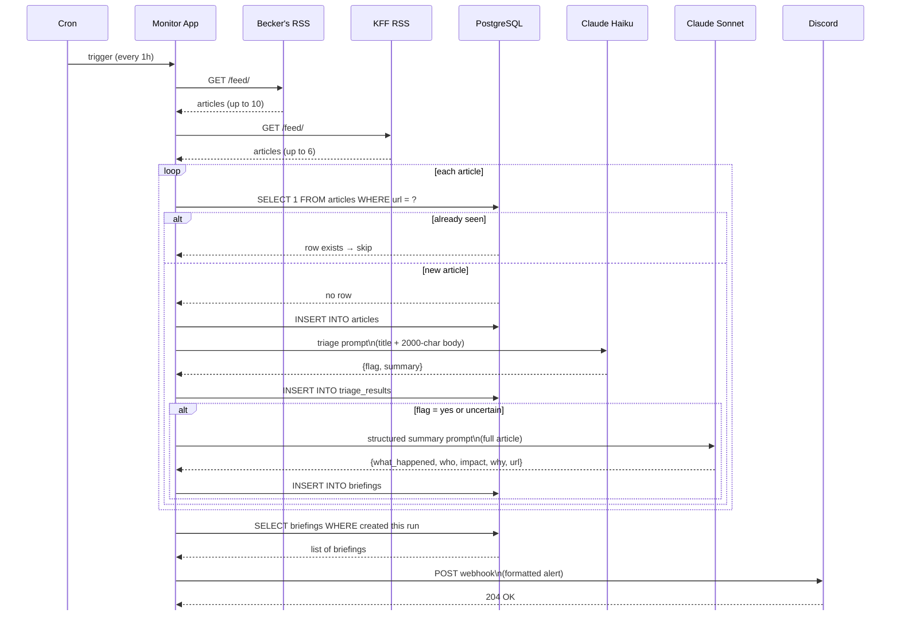

# Phase 3 Design — Monitor Pipeline, Discord Alerts, Laptop→AWS Migration

_AGE-34 | Last updated: 2026-07-07_

---

## 1. What We're Building

A scheduled monitor that runs every hour, scrapes Becker's Payer and KFF Health News RSS feeds, triages new articles against the v1 prompt, and posts a structured Discord alert when significant articles are found.

Designed to run on a developer laptop today and migrate to AWS Free Tier in ~2 weeks with no code changes — only environment variable updates.

---

## 2. C4 Level 2 — Container (AWS Free Tier)



---

## 3. C4 Level 3 — Component (Monitor App)



---

## 4. Sequence Diagram — Happy Path

A run where new articles are found and at least one passes triage.



---

## 5. Discord Alert Format

Posted only when ≥1 article is flagged `yes` or `uncertain`.

```
🔔 Health Insurance News — 2 new alerts

━━━━━━━━━━━━━━━━━━━━━━
📌 Northwell, Fidelis face network split affecting 240,000

What happened: Northwell Health and Fidelis Care (Centene) are heading toward a 
July 15 contract termination, with 240,000 Medicaid, MA, and Essential Plan members 
at risk of losing in-network access.

Who's involved: Northwell Health (provider) · Fidelis Care / Centene (insurer)

Members/revenue at stake: 240,000 members across Medicaid, Medicare Advantage, 
and Essential Plan. Northwell cites $100M in unpaid claims.

Why it matters: One of the largest active network splits in New York. If unresolved, 
it sets a precedent for Centene's reimbursement posture with major urban health systems.

🔗 https://beckerspayer.com/contracting/northwell-fidelis-...
━━━━━━━━━━━━━━━━━━━━━━
```

---

## 6. Component Map (AWS Target State)

| Component | File | Model | AWS placement |
|-----------|------|-------|---------------|
| Orchestrator | `scheduler.py` | — | EC2 t2.micro |
| Becker's monitor | `agent/scraper.py` | — | EC2 t2.micro |
| KFF monitor | `agent/kff_monitor.py` | — | EC2 t2.micro |
| Triage agent | `agent/triage.py` | claude-haiku-4-5 | EC2 t2.micro |
| Structured summary | `agent/summarizer.py` | claude-sonnet-4-6 | EC2 t2.micro |
| Discord notifier | `agent/discord.py` | — | EC2 t2.micro |
| PostgreSQL | — | — | RDS db.t3.micro |

> Backfill scripts (`agent/scraper.py --backfill`, `agent/kff_scraper.py`) are run manually from the analyst laptop and are not deployed to AWS. See Section 7.

---

## 7. Laptop → AWS Migration Plan

### Architecture comparison

The laptop and AWS implementations run identical Python code. The differences are entirely in infrastructure.

| Concern | Laptop (Phase 3 start) | AWS Free Tier (target) |
|---------|------------------------|------------------------|
| Compute | Local Python process, runs while laptop is on | EC2 t2.micro, always-on |
| Database | PostgreSQL in Docker Desktop | RDS db.t3.micro (PostgreSQL 15) |
| Scheduler | `launchd` plist or manual `cron` | System `cron` on EC2 — identical syntax |
| Secrets | `.env` file in project root | `.env` file on EC2 instance |
| Uptime | Interrupted by sleep, lid close, restarts | 24/7, survives laptop off |
| Backfill | Headed Chrome CDP — runs on laptop | Stays on laptop permanently (CDP requires headed browser) |

### What does not change when migrating

- All Python source code — zero changes
- Cron expression — `0 * * * *` is identical
- `.env` key names — only `DATABASE_URL` value changes
- Discord webhook URL
- DB schema — `pg_dump` / `pg_restore` carries it over exactly

### Migration steps

1. Launch EC2 t2.micro (Amazon Linux 2023) in default VPC
2. Launch RDS db.t3.micro (PostgreSQL 15), same VPC, private subnet
3. Migrate data: `pg_dump` local → `pg_restore` to RDS
4. SSH into EC2; clone repo, create `.venv`, `pip install -r requirements.txt`
5. Create `.env` on EC2; set `DATABASE_URL` to RDS endpoint, copy remaining keys
6. Add cron entry: `0 * * * * cd /home/ec2-user/app && .venv/bin/python -m scheduler >> /var/log/monitor.log 2>&1`
7. Trigger one manual run; confirm articles stored and Discord alert fires
8. Shut down local Docker Postgres

### Cost estimate (AWS Free Tier)

| Service | Free tier limit | Expected usage |
|---------|----------------|----------------|
| EC2 t2.micro | 750 hrs/month | ~720 hrs/month ✅ |
| RDS db.t3.micro | 750 hrs/month | ~720 hrs/month ✅ |
| RDS storage | 20 GB | <1 GB ✅ |
| Data transfer out | 1 GB/month | <100 MB/month ✅ |

Stays within free tier indefinitely at current article volume.

---

## 8. Environment Variables

| Variable | Description |
|----------|-------------|
| `DATABASE_URL` | PostgreSQL connection string (only value differs between laptop and EC2) |
| `ANTHROPIC_API_KEY` | Claude API key |
| `DISCORD_WEBHOOK_URL` | Discord channel webhook |

---

## 9. DB Schema Changes

Two new tables. The existing `articles` table is unchanged.

```sql
CREATE TABLE IF NOT EXISTS triage_results (
    id              SERIAL PRIMARY KEY,
    article_id      INTEGER NOT NULL REFERENCES articles(id),
    scrape_run_id   INTEGER REFERENCES scrape_runs(id),
    flag            TEXT NOT NULL CHECK (flag IN ('yes', 'uncertain', 'no')),
    summary         TEXT,
    model           TEXT NOT NULL,
    triaged_at      TIMESTAMPTZ NOT NULL DEFAULT now()
);

CREATE TABLE IF NOT EXISTS briefings (
    id                  SERIAL PRIMARY KEY,
    article_id          INTEGER NOT NULL REFERENCES articles(id),
    triage_result_id    INTEGER NOT NULL REFERENCES triage_results(id),
    scrape_run_id       INTEGER REFERENCES scrape_runs(id),
    what_happened       TEXT NOT NULL,
    who                 TEXT NOT NULL,
    impact              TEXT NOT NULL,
    why_it_matters      TEXT NOT NULL,
    model               TEXT NOT NULL,
    created_at          TIMESTAMPTZ NOT NULL DEFAULT now(),
    discord_sent_at     TIMESTAMPTZ
);
```

> `url` is not stored in `briefings` — the Discord notifier joins `articles` on `article_id` to retrieve it. `discord_sent_at` is `NULL` until the alert posts successfully.

---

## 10. Prompts

### Triage prompt (Claude Haiku)

Already in production at `scripts/export_for_labeling.py`. Canonical text:

```
SYSTEM:
You are a health insurance industry analyst assistant.
Your job is to screen news articles for a senior analyst who tracks major relationship changes
between health insurance carriers and healthcare providers.

Relationship changes of interest include:
- Acquisitions or mergers (insurer buys insurer, provider buys provider, insurer buys provider)
- Partnerships or new network agreements
- Divestitures or spin-offs
- Contract terminations or network exits (a provider leaving an insurer's network, or vice versa)
- TPA or administrator switches (a large employer changing its claims processor)

When in doubt, FLAG IT. We prefer false positives over false negatives — the analyst can quickly
rule out borderline cases, but missed hits can't be recovered.

Do NOT flag: earnings reports with no relationship change, general policy/regulatory news,
clinical/medical research, personnel announcements (unless the role change signals a deal),
or soft PR stories without a concrete business action.

Respond in JSON with exactly two fields:
  "flag": one of "yes", "uncertain", or "no"
  "summary": a 2-sentence plain-English summary of what the article is about

USER:
Title: {title}

Body (first 2000 chars):
{body_preview}
```

### Structured summary prompt (Claude Sonnet)

Only called when `flag` is `yes` or `uncertain`. Produces the 4-field brief written to `briefings`.

```
SYSTEM:
You are a briefing tool for a health insurance industry analyst.
You receive a news article about a potential relationship change between a health insurance carrier
and a healthcare provider. Your job is to extract a concise, structured summary.

Be specific and factual. Use entity names, not pronouns. If a field cannot be determined from
the article, write "Not stated" — do not infer or speculate.

Respond in JSON with exactly four fields:
  "what_happened": 2–3 sentences describing the specific business action or change
  "who": the key entities and their roles (e.g. "Northwell Health (provider) · Fidelis Care / Centene (insurer)")
  "impact": members affected, revenue at stake, or market scope — use numbers from the article if available
  "why_it_matters": 1–2 sentences on the strategic significance or precedent this sets

USER:
Title: {title}

Full article:
{body_text}
```

---

## 11. Acceptance Criteria

```gherkin
Feature: Hourly monitor pipeline

  Scenario: New article flagged yes
    Given an article about a provider/insurer contract termination is published on Becker's RSS
    When the hourly run fetches the feed
    Then the article is inserted into articles
    And triage_results has a row with flag = 'yes'
    And briefings has a row with all four fields non-empty
    And a Discord alert is posted containing the article title and url

  Scenario: New article flagged no
    Given an article about a health tech product launch is published on KFF RSS
    When the hourly run fetches the feed
    Then the article is inserted into articles
    And triage_results has a row with flag = 'no'
    And no row is inserted into briefings
    And no Discord webhook is called

  Scenario: New article flagged uncertain
    Given an article with ambiguous signals (e.g. insurer "signals intent to renegotiate")
    When the hourly run processes it
    Then triage_results has a row with flag = 'uncertain'
    And briefings has a row with all four fields non-empty
    And the article is included in the Discord alert

  Scenario: No articles pass triage
    Given an hourly run where all fetched articles are flagged 'no'
    When the run completes
    Then no Discord webhook is called
    And discord_sent_at remains null for all briefings from this run

  Scenario: Duplicate article is skipped
    Given an article URL already present in the articles table from a prior run
    When the hourly run fetches the same URL
    Then no new row is inserted into articles
    And triage is not called for that URL

  Scenario: Discord alert marks delivery
    Given briefings exist for the current run
    When the Discord notifier posts the webhook successfully
    Then discord_sent_at is set to the current timestamp for each briefing in the alert
```

---

## 12. Open Questions

| # | Question | Status |
|---|----------|--------|
| Q1 | Should `uncertain` articles be included in Discord alerts? | Decided — yes |
| Q2 | What is the cron interval? | Decided — 1 hour |
| Q3 | Secrets management on EC2? | Decided — `.env` file on instance (can upgrade to SSM later) |
| Q4 | What KFF categories/feeds to monitor? | Decided — `https://kffhealthnews.org/state/california/feed/` |
