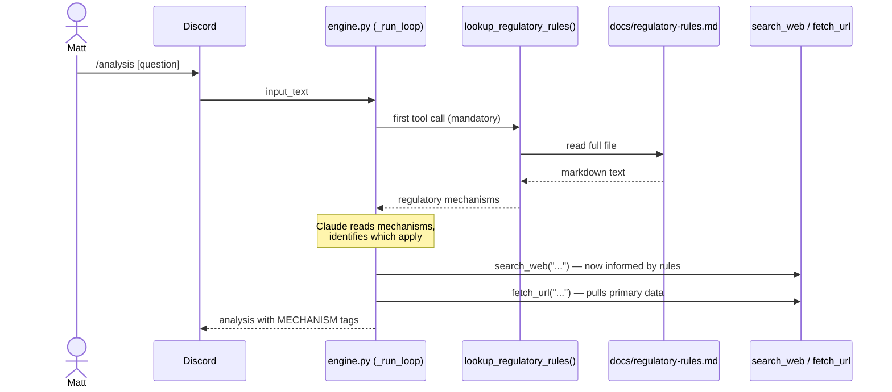

# Spec: `lookup_regulatory_rules` Tool

_Status: draft_
_Last updated: 2026-08-26_

---

## Background — Why This Exists

In AGE-71 (CalOptima entering OC's Covered CA market), Matt's analysis missed SB 260's
alternate-default pathway in its first two drafts. SB 260 is a 2019 California statute that
auto-enrolls Medi-Cal leavers into the county's lowest-cost Silver plan. Because of it,
Anthem loses the SB 260 acquisition channel the moment CalOptima holds the county default
slot — regardless of price.

This miss happened because no 2026 news article mentions SB 260, and no enrollment dataset
contains it. An agent that only searches the web and reads data files cannot find it. Matt
caught it by reviewing his own work a third time.

The rules layer is the fix. It is a curated document of standing regulatory mechanisms
that govern how members move between plans. The agent reads it first — before any search
or data pull — so that these invisible mechanisms surface at the start of every analysis,
not after the fact.

**The SB 260 class of miss:** a regulatory mechanism that is real, load-bearing, and
completely invisible to any data-only research strategy. The rules layer is a structural
fix to this class of problem.

---

## What This Spec Covers

1. The `lookup_regulatory_rules` tool — implementation and tool definition
2. The `docs/regulatory-rules.md` file — format and initial seed content
3. The system prompt change that makes the tool call mandatory
4. How Matt maintains the file over time

---

## User Story

As the AnalystAgent, I need to consult a curated set of standing regulatory mechanisms
before pulling any data, so that mechanisms like SB 260 — which appear in no dataset and
no recent headline — are surfaced at the start of every analysis rather than missed entirely.

---

## Acceptance Criteria

1. The agent calls `lookup_regulatory_rules` as its first tool call on every new analysis
2. The tool returns the full content of `docs/regulatory-rules.md` without filtering or summarization
3. The system prompt explicitly instructs the agent to call this tool first, before any web search or data fetch
4. `docs/regulatory-rules.md` contains at minimum the four seed mechanisms listed below
5. Adding a new mechanism to the file requires no code change — only a document edit

---

## Diagram — Where This Tool Fits in the Loop



---

## Integration Points

Three files change. No new dependencies.

| File | Change |
|---|---|
| `agent/analyst/tools/lookup_regulatory_rules.py` | New file — reads and returns `docs/regulatory-rules.md` |
| `agent/analyst/engine.py` | Add tool to `TOOLS` list; add to `_TOOL_DISPATCH`; update `SYSTEM_PROMPT` |
| `.github/workflows/deploy-analyst.yml` | Bundle `docs/regulatory-rules.md` into the Lambda zip |

`docs/regulatory-rules.md` is created separately (seed content below) and maintained by Matt — no code change when it changes.

---

## Technical Design

### Tool Implementation

The tool has no arguments and no logic. It reads a file and returns it.

```python
def lookup_regulatory_rules() -> str:
    """Return the full content of docs/regulatory-rules.md."""
    path = Path(__file__).parents[3] / "docs" / "regulatory-rules.md"
    return path.read_text(encoding="utf-8")
```

The file path resolves relative to the tool file so it works in both Lambda (where the
file is bundled) and locally.

### Tool Definition (added to `TOOLS` in `engine.py`)

```python
{
    "name": "lookup_regulatory_rules",
    "description": (
        "Read the standing regulatory mechanisms that govern member flows "
        "across CA, NV, CO, MO, WI, NY, and NJ. Call this first, before "
        "any web search or data fetch. Returns the full rules document."
    ),
    "input_schema": {
        "type": "object",
        "properties": {},
        "required": [],
    },
}
```

### System Prompt Change

**Before** (`engine.py` current):
```
Focus on: network impacts, membership effects, competitive dynamics, regulatory implications.
Be direct and specific. Start every analysis with search_web to locate relevant sources.
Before drawing conclusions, read at least 3 URLs with fetch_url.
Cite the source URL for each factual claim.
```

**After:**
```
Focus on: network impacts, membership effects, competitive dynamics, regulatory implications.
Be direct and specific.

Start every analysis by calling lookup_regulatory_rules. Read every mechanism it returns
and consider whether it applies before doing anything else. Then use search_web to locate
relevant sources and fetch_url to read primary data.

Tag regulatory mechanism claims as [MECHANISM] — established program rule verifiable in
statute or regulation, not requiring a source URL.
Before drawing conclusions, read at least 3 URLs with fetch_url.
Cite the source URL for each factual claim.
```

The two changes:
1. `lookup_regulatory_rules` replaces `search_web` as the mandatory first step
2. A `[MECHANISM]` confidence tag is added alongside HIGH / MED / LOW — for claims sourced from the rules layer rather than a fetched document

### Deployment: Bundling `regulatory-rules.md` into Lambda

The file must be included in the Lambda zip. Add to the Package step in
`.github/workflows/deploy-analyst.yml`:

```yaml
cp docs/regulatory-rules.md package/docs/regulatory-rules.md
```

And create the `docs/` directory in the package before copying:
```yaml
mkdir -p package/docs
```

---

## `docs/regulatory-rules.md` — Format

Each entry follows this structure:

```markdown
## [Program] — [State or National] — [Mechanism name]

**Mechanism:** Plain-language description of the standing rule and what triggers it.

**Effect on member flows:** What actually happens to members as a result — who gains,
who loses, under what conditions.

**Where to find evidence:** Where to look for data confirming this mechanism is in play.
This is directional guidance, not a permanent URL — use search_web to find the current file.

**Relevant statute or regulation:** [cite]
```

---

## `docs/regulatory-rules.md` — Seed Content

This is the initial content of the file. Matt reviews and extends it.

---

### ACA Individual — CA — SB 260 Default Enrollment

**Mechanism:** California SB 260 (2019) requires Covered CA to auto-enroll Medi-Cal
members who lose eligibility into the lowest-cost Silver plan in their county. The carrier
holding the "default slot" receives this inflow automatically without competing for it.

**Effect on member flows:** The carrier holding the county default slot gains passive
enrollment inflow from Medi-Cal leavers every year. A new entrant offering the lowest-cost
Silver in a county displaces the incumbent from the default slot — the incumbent loses
both the inflow and any existing subsidized Silver members who face a widening premium gap.

**COHS alternate-default:** In counties where a County Organized Health System (COHS)
operates (e.g., Orange County / CalOptima), the COHS plan takes statutory precedence for
the default slot if it offers a Covered CA product in that county. Price is secondary —
the COHS relationship supersedes the price-based default. This makes a COHS entry
double-locked against the incumbent.

**Where to find evidence:**
- Covered CA publishes a county-level "SB-260 Lowest Cost Silver Plan" table annually
  (PDF). Search: `"Covered California SB 260 lowest cost silver by county [year]"`
- Covered CA Active Member Profile XLSX — enrollment by carrier, county, and metal tier.
  Search: `"Covered California active member profile [year] XLSX"`

**Relevant statute:** Cal. Health & Safety Code §1399.849 (SB 260, 2019)

---

### ACA Individual — CA — Benchmark Silver and APTC Mechanics

**Mechanism:** The Advance Premium Tax Credit (APTC) is calculated as the difference
between the second-lowest-cost Silver plan premium (the "benchmark") and the enrollee's
income-based contribution. When a new carrier enters below the benchmark, the benchmark
drops — all subsidized Silver enrollees in that county face a reduced APTC, making
staying in a higher-cost plan more expensive.

**Effect on member flows:** A new entrant undercutting the benchmark widens the effective
price gap for every subsidized Silver enrollee in the county simultaneously. Members don't
need to actively shop — the economics shift at plan year, and those who don't switch pay
more. A carrier entering below Anthem's Silver rate shifts switching incentives market-wide,
not just for members who notice the new entrant.

**Where to find evidence:**
- Covered CA rate filings and rate comparison tools at coveredca.gov
- CMS Risk Adjustment Appendix C (XLSX) for RA financial impacts

---

### Medicare Advantage — National — CMS Marketing Approval Rules

**Mechanism:** CMS requires carriers to receive approval before publicly naming the states
or counties where a new MA plan will be offered. Carriers often announce a partnership or
market entry before CMS approval is complete.

**Effect on member flows:** When a news article or press release says "two unnamed states"
or "pending regulatory review," the states are not secret — they are awaiting CMS filing
approval. This is not a data gap; it is a process gap. The agent should surface this as a
timed blocker (states typically named 60–90 days before AEP) rather than treating it as
unknown information.

**Where to find evidence:**
- CMS MA Enrollment by Plan and County (annual release): search CMS.gov
- CMS rate announcements and plan benefit packages on cms.gov/Medicare/Prescription-Drug-Coverage

---

### Medicaid — CA — Medi-Cal Continuous Enrollment Unwinding

**Mechanism:** Federal COVID-era continuous enrollment protections ended in 2023. California
began redetermining Medi-Cal eligibility in waves through 2024–2025. Members losing Medi-Cal
eligibility with income above Medicaid thresholds are eligible for Covered CA — and SB 260
auto-enrolls them into the county default slot carrier.

**Effect on member flows:** The post-COVID redetermination wave produces ongoing Medi-Cal
leaver inflow into Covered CA through 2025–2026. The SB 260 default slot carrier receives
this inflow passively. A county default slot change mid-wave redirects the inflow to the
new default holder for the remainder of the eligibility year.

**Where to find evidence:**
- DHCS Medi-Cal eligibility redetermination dashboard (dhcs.ca.gov)
- CMS unwinding data at medicaid.gov

---

## How Matt Extends This File

Matt edits `docs/regulatory-rules.md` directly. No code change is needed. The agent reads
whatever is in the file at invocation time.

When to add a new entry:
- A mechanism affected the analysis but wasn't in the file (post-mortem additions)
- A new state or program is brought into scope
- A statute or regulation changes the member flow dynamics

Format: follow the template above. The agent reads the full document and reasons over it —
entries do not need to be machine-parseable, only clear.

---

## Scenarios

```gherkin
Scenario: Agent calls lookup_regulatory_rules first on a new analysis
  Given Matt submits "/analysis how does CalOptima entering OC affect Anthem?"
  When the engine starts the tool loop
  Then the first tool call is lookup_regulatory_rules
  And subsequent tool calls use search_web or fetch_url

Scenario: SB 260 is surfaced from the rules layer, not the web
  Given the rules layer contains the SB 260 alternate-default entry
  And no 2026 news article mentions SB 260 by name
  When the agent analyzes a CalOptima / OC Covered CA event
  Then the analysis references SB 260 and the COHS alternate-default pathway
  And the claim is tagged MECHANISM (not MED or LOW)

Scenario: New mechanism added with no code change
  Given Matt adds a new entry to docs/regulatory-rules.md
  When the agent is next invoked (no redeploy)
  Then the new mechanism is returned by lookup_regulatory_rules
  And the agent reasons over it as part of its analysis

Scenario: Rules layer is empty or missing
  Given docs/regulatory-rules.md does not exist or is empty
  When lookup_regulatory_rules is called
  Then the tool returns a clear error string
  And the agent proceeds with search_web and fetch_url only
  And analysis notes that the rules layer was unavailable
```

---

## Out of Scope

- Filtering the rules document by state or program — the agent reads the full document
  and reasons over it; filtering is premature optimization
- Automated updates to the rules layer — Matt maintains it manually
- Validation of rule entries — the file is trusted as written
