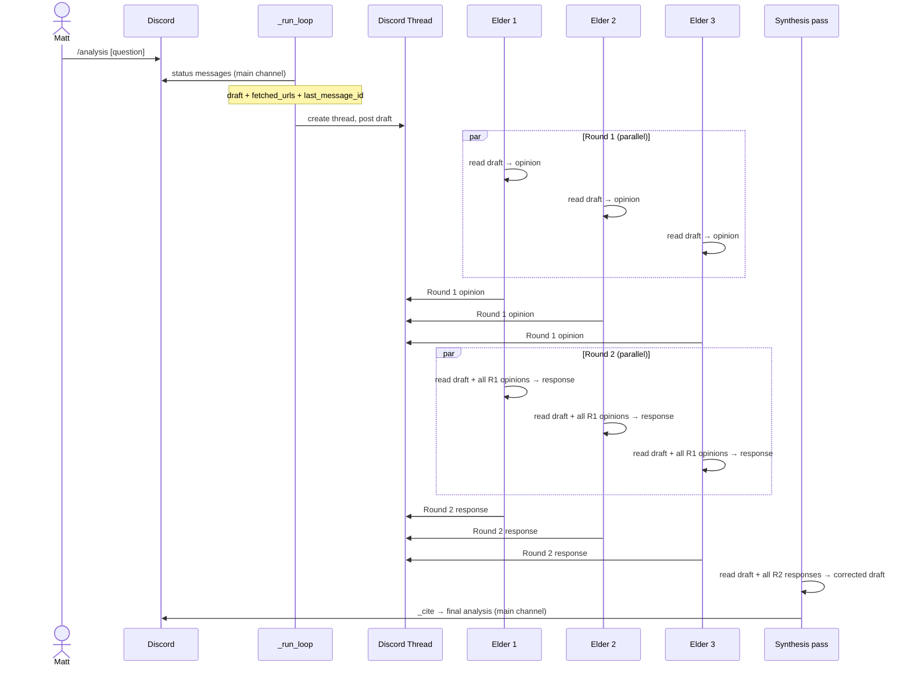

# Spec: Council of Elders

_Status: draft — blocked on elder domain selection_
_Last updated: 2026-08-27_
_Linear: [AGE-102](https://linear.app/eric-projects/issue/AGE-102/council-of-elders-two-round-parallel-domain-expert-deliberation)_

---

## Background — Why This Exists

The fact-checker (AGE-99) is a generalist skeptic — same model, different attitude. It catches
hallucinated numbers and unsupported absolutes, but it has no domain expertise. It cannot catch
a regulatory miss it doesn't know to look for, or a competitive framing that's directionally
wrong but hard to disprove without specialized knowledge.

A council of domain specialists solves a different problem: not "is this claim verifiable?" but
"is this claim right given what an expert in this domain would know?" Each elder brings a focused
lens. Two rounds of deliberation mean each elder can respond to what the others said — not just
a parallel monologue, but a real exchange.

---

## Open Questions — Blocked

> **⚠ Implementation is blocked until Matt answers:**
>
> 1. **What are the three elder domains?** (e.g., Regulatory, Market Sizing, Competitive Dynamics)
> 2. **Does the council replace `_fact_check` or run alongside it?** Recommendation: replace —
>    elders do both verification and enrichment; a separate generalist pass adds latency for
>    little gain. But Matt should decide.

---

## User Story

As Matt (analyst), I want my draft analysis reviewed by three domain specialists who deliberate
with each other before the final analysis reaches me, so that domain-specific errors and gaps are
caught by someone who actually knows the field — not just a generalist skeptic.

---

## Acceptance Criteria

1. After the analyst produces a draft, three elder agents run Round 1 in parallel — each reads
   the draft and writes their initial opinion independently
2. After Round 1 completes, three elder agents run Round 2 in parallel — each reads the draft,
   all three Round 1 opinions, and writes a response (affirm, challenge, or update)
3. After Round 2, a synthesis pass produces the corrected final draft incorporating all elder
   notes
4. All elder opinions (Round 1 and Round 2) are posted to the Discord audit thread so the
   deliberation is visible
5. The final cited analysis is posted to the main channel
6. Total added latency is under 60 seconds at current volume (one analysis per week)

---

## Diagram



---

## Technical Design

### No tools — pure reasoning

Elders do not have tools. Each elder is a single `messages.create` call. Their domain expertise
lives entirely in their system prompt. This keeps each round fast (seconds, not minutes) and
avoids tool call complexity in six concurrent agents.

### Parallelism — `ThreadPoolExecutor`

Both rounds use `ThreadPoolExecutor(max_workers=3)`. Each elder is a `concurrent.futures.Future`.
The main thread waits for all three before advancing to the next round.

```python
def _run_round(draft: str, elder_prompts: list[str], prior_opinions: list[str] = None) -> list[str]:
    def _call_elder(system_prompt: str) -> str:
        context = draft
        if prior_opinions:
            context += "\n\n---\n\nRound 1 opinions from other elders:\n\n" + "\n\n---\n\n".join(prior_opinions)
        resp = client.messages.create(
            model=MODEL, max_tokens=1024, system=system_prompt,
            messages=[{"role": "user", "content": context}],
        )
        return resp.content[0].text.strip()

    with ThreadPoolExecutor(max_workers=3) as pool:
        futures = [pool.submit(_call_elder, p) for p in elder_prompts]
        return [f.result() for f in futures]
```

### Discord thread posting

After each round, post each elder's opinion to the audit thread with a header:

```
**[Elder Name] — Round 1**
[opinion text]
```

```
**[Elder Name] — Round 2**
[response text]
```

### Synthesis pass

A single `messages.create` call (no tools) with the analyst system prompt, the draft, and all
Round 2 opinions as input. Returns the corrected analysis text. Then `_cite` runs on the result.

### Handler orchestration

```python
analysis, fetched_urls, last_msg_id = _run_loop(messages, token, channel_id)
persistence.update_conversation(db, conversation_id, messages)

thread_id = create_thread(channel_id, last_msg_id, input_text[:100]) if last_msg_id else None
effective_thread = thread_id or channel_id

if thread_id:
    for chunk in split(f"**Draft analysis:**\n\n{analysis}"):
        post_channel_message(thread_id, chunk)

# Round 1
post_channel_message(effective_thread, "**Council — Round 1**")
r1_opinions = _run_round(analysis, ELDER_PROMPTS)
for name, opinion in zip(ELDER_NAMES, r1_opinions):
    for chunk in split(f"**[{name}] — Round 1**\n{opinion}"):
        post_channel_message(effective_thread, chunk)

# Round 2
post_channel_message(effective_thread, "**Council — Round 2**")
r2_opinions = _run_round(analysis, ELDER_PROMPTS, prior_opinions=r1_opinions)
for name, opinion in zip(ELDER_NAMES, r2_opinions):
    for chunk in split(f"**[{name}] — Round 2**\n{opinion}"):
        post_channel_message(effective_thread, chunk)

# Synthesis
final_analysis = _synthesize(analysis, r2_opinions)
cited = _cite(final_analysis, fetched_urls)
delete_original(token)
for chunk in split(f"{cited}\n\nConversation ID: {conversation_id}"):
    post_channel_message(channel_id, chunk)
```

### Discord rate limits

Six elder calls post to the same thread sequentially (after each round completes). No concurrent
posting to Discord — the parallelism is only in the API calls to Anthropic. Rate limit risk is low.

### Elder system prompt shape

Each elder prompt follows this structure (content TBD pending domain selection):

```
You are the [Domain] elder on a council reviewing a health insurance industry analysis.
Your expertise is [domain description]. You have deep knowledge of [specific areas].

Read the draft analysis. Write your opinion in this format:
- Flag any claims in your domain that are wrong, overstated, or missing important nuance
- Confirm claims in your domain that are correct
- Add any domain-specific context the analyst missed

Be direct and specific. Under 200 words. No preamble.
```

Round 2 adds one instruction: "You have now seen your fellow elders' Round 1 opinions. Where you
agree, say so briefly. Where you disagree, explain why. Where another elder raised something you
missed, acknowledge it."

---

## Integration Points

| File | Change |
|---|---|
| `agent/analyst/engine.py` | Remove `_fact_check`; add `_run_round`, `_synthesize`, `ELDER_PROMPTS`, `ELDER_NAMES`; update handler |

No new files, no new dependencies, no new Lambda.

---

## Scenarios

```gherkin
Scenario: Elder catches a domain-specific miss
  Given the analyst omits a regulatory mechanism in the draft
  And the Regulatory elder's system prompt covers that mechanism
  When Round 1 runs
  Then the Regulatory elder's opinion flags the miss
  And the Round 2 synthesis incorporates it into the final analysis

Scenario: Elders disagree in Round 2
  Given the Competitive elder says "Anthem cannot replicate this channel"
  And the Market Sizing elder says "Anthem's existing OTC card partially overlaps"
  When Round 2 runs
  Then each elder reads the other's Round 1 opinion and responds
  And the synthesis resolves the tension with the most defensible position

Scenario: All elders agree — no issues
  Given all three elders confirm the draft's claims in their domains
  When both rounds complete
  Then the synthesis returns the original draft largely unchanged
  And the thread shows three Round 1 confirmations and three Round 2 affirmations

Scenario: Thread creation fails
  Given Discord returns an error when creating the thread
  When the handler falls back to effective_thread = channel_id
  Then all elder opinions are posted to the main channel instead
  And the analysis still completes

Scenario: One elder API call fails
  Given one ThreadPoolExecutor future raises an exception
  When the round collects results
  Then the failed elder's opinion is replaced with an error note
  And the remaining two opinions proceed to Round 2 and synthesis
```

---

## Out of Scope

- More than two rounds of deliberation — two rounds is sufficient for the use case
- Elders using tools (search, fetch) — pure reasoning only; tool use is the analyst's job
- More than three elders — complexity scales with elder count; three is the right starting point
- Storing elder opinions in the database — the thread is the audit trail
- Running the council on follow-up questions — v1 only on initial analyses
