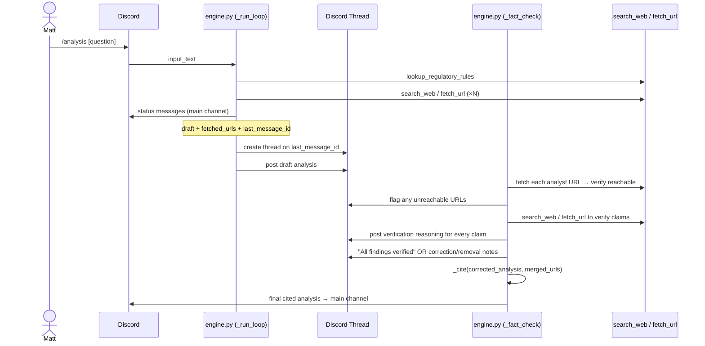

# Spec: Fact-Checker Agent

_Status: draft_
_Last updated: 2026-08-27_

---

## Background — Why This Exists

The analyst (Claude Opus) hallucinates in two ways: training-data bleed-through (recalled
"74M" Costco members — wrong, not in any fetched source) and citation attachment (cited a
USA Today article that didn't contain the cited figure). Prose framing can also be
unsupported — strategic claims like "Anthem cannot replicate this" carry the load-bearing
logic Matt acts on, and fail silently if wrong.

Matt is an executive at Elevance Health making competitive decisions on this output. At ~1
analysis per week, the cost and latency of a second verification pass are irrelevant.

The fix is an independent agent that did not write the analysis, has no attachment to it,
and actively tries to disprove every claim before it reaches Matt. Every step of that
verification work is posted to a Discord thread so Matt has a full audit trail.

---

## What This Spec Covers

1. The fact-checker tool loop — runs in the same Lambda after the analyst finishes
2. The Discord thread — auditable record of every verification step
3. Changes to `discord.py` — `post_channel_message` returns message ID; new `create_thread`
4. Changes to `engine.py` — `_cite` pulled out of `_run_loop`; new `_fact_check`; handler orchestration
5. Citation handling — `_cite` runs once, on the fact-checker's corrected output, with merged URL list

---

## User Story

As Matt (analyst), I want every analysis to be independently verified before it reaches me,
so that I can trust the findings and citations without manually fact-checking them myself.

As Eric (operator), I want a full record of what the fact-checker verified, corrected, and
removed — posted to a Discord thread — so I can audit the system's accuracy over time.

---

## Acceptance Criteria

1. After the analyst produces a draft, the system creates a Discord thread on the last
   status message posted to the main channel, named after Matt's original question
2. The draft analysis is posted to the thread
3. The fact-checker verifies every URL in the analyst's source list by fetching it — if a
   URL is unreachable or returns empty content, it is flagged in the thread and its citation
   is dropped
4. The fact-checker verifies every claim — numeric and prose — posting its reasoning to
   the thread as it works: what it checked, what it found, what it did
5. For each confirmed claim: the fact-checker posts a brief confirmation to the thread
6. For each corrected or removed claim: the fact-checker posts a clear explanation stating
   what was wrong, what the correct information is (if found), and why the claim was
   changed
7. If no issues are found, the fact-checker posts "All findings verified" to the thread
8. The final corrected analysis, with inline citation numbers, is posted to the main channel

---

## Diagram



---

## Integration Points

| File | Change |
|---|---|
| `agent/analyst/discord.py` | `post_channel_message` returns message ID; new `create_thread(channel_id, message_id, name)` → thread\_id |
| `agent/analyst/engine.py` | `_cite` removed from `_run_loop`; `_run_loop` returns `(analysis, fetched_urls, last_message_id)`; new `_fact_check`; handler orchestrates full pipeline |

No new tools, no new files, no new Lambda, no new dependencies.

---

## Technical Design

### `post_channel_message` — return message ID

Currently returns `None`. Change to parse and return the Discord message snowflake ID:

```python
def post_channel_message(channel_id: str, text: str) -> str | None:
    resp = requests.post(...)
    try:
        return resp.json().get("id")
    except Exception:
        return None
```

`_run_loop` updates `last_message_id` on every call. If a call fails and returns `None`,
retain the previous `last_message_id` — do not overwrite with `None`.

### `create_thread` — new function

```python
def create_thread(channel_id: str, message_id: str, name: str) -> str | None:
    resp = requests.post(
        f"{DISCORD_API}/channels/{channel_id}/messages/{message_id}/threads",
        headers={"Authorization": f"Bot {os.environ['DISCORD_BOT_TOKEN']}"},
        json={"name": name[:100], "auto_archive_duration": 1440},
        timeout=10,
    )
    try:
        return resp.json().get("id")
    except Exception:
        return None
```

Thread name: Matt's original question, truncated to 100 characters.

### `_run_loop` — changes

1. Remove the `_cite` call — return raw analysis text
2. Track `last_message_id` — update on every `post_channel_message` call
3. Return `(analysis: str, fetched_urls: list[str], last_message_id: str | None)`

### `_fact_check` — new function

```python
def _fact_check(draft: str, fetched_urls: list[str], thread_id: str, channel_id: str) -> tuple[str, list[str]]:
    """Run the fact-checker tool loop. Returns (corrected_analysis, all_fetched_urls)."""
```

The fact-checker runs a standard tool loop (`search_web`, `fetch_url`) with:
- `thread_id` for all status messages — everything goes to the thread, not main channel
- A different system prompt (see below)

It returns the corrected analysis text and the merged URL list (analyst's + its own fetches).

### Fact-checker system prompt

```
You are an independent fact-checker reviewing an analyst's draft. You did not write
this analysis and have no stake in it being correct. Your job is to disprove it.

You will post your verification work to Discord as you go. Do not work silently.
Every check — confirmed, corrected, or removed — gets a note in the thread.

Step 1 — URL verification: fetch each URL in the source list. If a URL is
unreachable or returns empty/error content, post immediately:
  "⚠ URL unreachable: [url] — citation dropped"
and treat any claim citing it as unverified.

Step 2 — Claim verification: for every factual claim — numeric and prose — search
for primary sources. For each claim post your reasoning:
  - Confirmed: "✓ [claim] — confirmed by [source]"
  - Corrected: "✗ [claim] — wrong. Correct: [X] per [source]. Updated in analysis."
  - Removed: "✗ [claim] — could not verify. Removed from analysis."

Pay particular attention to:
- Specific numbers: membership counts, percentages, revenue figures, dates
- Causal claims: "X gives Y an advantage Z cannot replicate"
- Absolutes: "cannot," "will," "only"
- Market definitions and geographic scope

If you find no issues, post: "✓ All findings verified."

After verification, rewrite the analysis incorporating all corrections and removals.
Return the corrected analysis as your final text response.
```

### `_cite` — no change to logic, moved out of `_run_loop`

`_cite` now runs in the handler after `_fact_check` returns, on the corrected analysis
with the merged URL list. The citation numbers in the final output correspond to the
merged list, which may include URLs the fact-checker fetched that the analyst did not.

### Handler orchestration

```python
# Analyst phase
post_channel_message(channel_id, f"**Analyzing:** {input_text}")
analysis, fetched_urls, last_msg_id = _run_loop(messages, token, channel_id)
persistence.update_conversation(db, conversation_id, messages)

# Thread setup
thread_id = create_thread(channel_id, last_msg_id, input_text[:100])
if thread_id:
    for chunk in split(f"**Draft analysis:**\n\n{analysis}"):
        post_channel_message(thread_id, chunk)

# Fact-check phase
effective_thread = thread_id or channel_id  # fallback if thread creation failed
post_channel_message(effective_thread, "Verifying findings...")
final_analysis, all_urls = _fact_check(analysis, fetched_urls, effective_thread, channel_id)

# Cite and post to main channel
cited = _cite(final_analysis, all_urls)
delete_original(token)
for chunk in split(f"{cited}\n\nConversation ID: {conversation_id}"):
    post_channel_message(channel_id, chunk)
```

---

## Scenarios

```gherkin
Scenario: Claim is confirmed — audit trail posted
  Given the analyst states "SCAN has ~460K MA members"
  And the fact-checker fetches a source confirming this figure
  When the fact-checker runs
  Then the thread receives: "✓ SCAN ~460K MA members — confirmed by scanhealthplan.com"
  And the claim appears unchanged in the final analysis

Scenario: Numeric claim is wrong — corrected with explanation
  Given the analyst states "Costco's ~74M member households"
  And the fact-checker cannot find 74M in any source
  And the fact-checker finds Costco FY2025 10-K reporting 81M paid members
  When the fact-checker runs
  Then the thread receives: "✗ '74M member households' — wrong. Correct: ~81M paid members per Costco FY2025 10-K. Updated in analysis."
  And the final analysis reads "Costco's ~81M paid members"

Scenario: URL is unreachable — citation dropped
  Given the analyst fetched https://example.com/article
  And the fact-checker's fetch_url call returns empty or error content
  When the fact-checker verifies URLs
  Then the thread receives: "⚠ URL unreachable: https://example.com/article — citation dropped"
  And claims citing that URL are treated as unverified

Scenario: Prose claim is unsupported — removed with explanation
  Given the analyst states "Anthem cannot replicate Costco's distribution advantage"
  And no source supports this as an absolute
  When the fact-checker runs
  Then the thread receives: "✗ 'cannot replicate' — no source supports this absolute. Removed; replaced with 'does not currently have a comparable retail distribution channel.'"
  And the final analysis uses the hedged version

Scenario: No issues found
  Given all claims are confirmed by fetched sources
  When the fact-checker runs
  Then the thread receives: "✓ All findings verified."
  And the final analysis matches the draft

Scenario: Thread creation fails
  Given Discord returns an error when creating the thread
  When the handler falls back to effective_thread = channel_id
  Then the fact-checker posts its verification work to the main channel instead
  And the analysis still completes and posts to the main channel

Scenario: Fact-checker finds a better source
  Given the analyst's claim is directionally correct but cited to a secondary source
  And the fact-checker finds the primary source (e.g., Costco 10-K) with a more precise figure
  When the fact-checker runs
  Then the thread notes: "✓ Confirmed — upgraded citation to primary source: Costco FY2025 10-K"
  And the final analysis cites the stronger source
```

---

## Out of Scope

- Fact-checking follow-up questions in an existing conversation — v1 only fact-checks
  initial analyses
- Storing fact-check results in the database — the thread is the audit trail
- Running the fact-checker on `[MECHANISM]` claims — those come from a curated file we
  control, not from web sources
- A separate Lambda invocation for the fact-checker — analyses run in under 2 minutes;
  the 15-minute Lambda limit is not a concern at current volume
