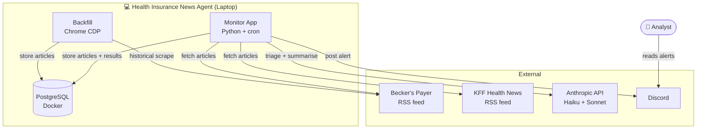
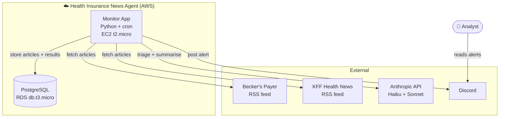
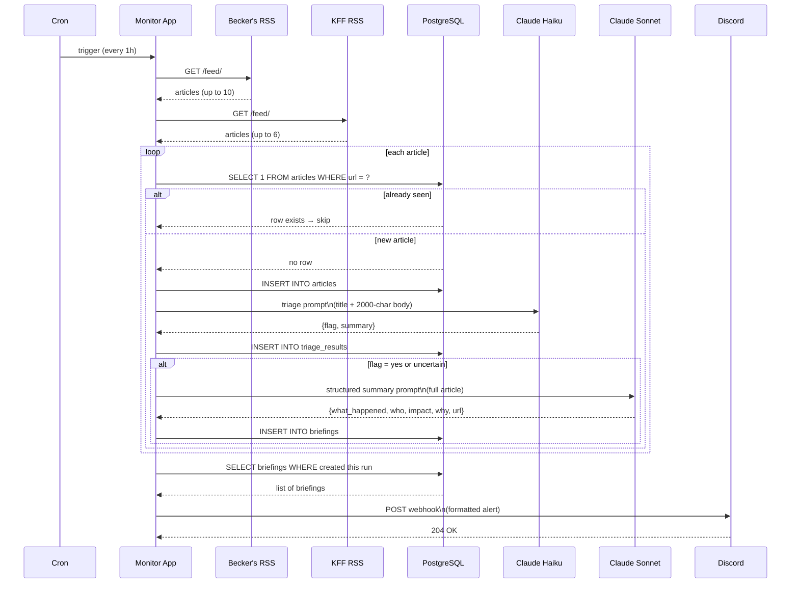
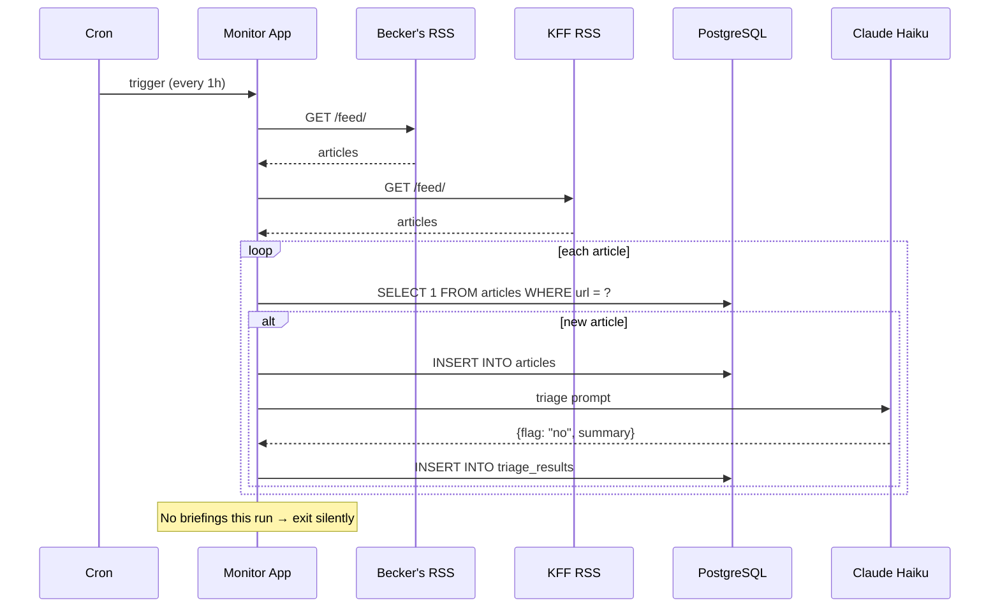

# Phase 3 Design — Monitor Pipeline, Discord Alerts, Laptop→AWS Migration

_AGE-34 | Last updated: 2026-07-07_

---

## 1. What We're Building

A scheduled monitor that runs every hour, scrapes Becker's Payer and KFF Health News RSS feeds, triages new articles against the v1 prompt, and posts a structured Discord alert when significant articles are found.

Designed to run on a developer laptop today and migrate to AWS Free Tier in ~2 weeks with no code changes — only environment variable updates.

---

## 2a. System Context — Laptop



---

## 2b. System Context — AWS Free Tier



> Note: Backfill (Chrome CDP) stays on the laptop permanently — it requires a headed browser and is not deployed to AWS.

    BACKFILL --> PG_L2
    BACKFILL <-->|headed Chrome CDP| BECKERS
```

**Key architectural boundary:** Backfill (Chrome CDP) requires a headed browser and stays laptop-only permanently. The monitor (RSS only) is fully portable.

---

## 3. Sequence Diagram — Happy Path

A run where new articles are found and at least one passes triage.



---

## 4. Sequence Diagram — No-Hit Run

The common case: new articles found but none pass triage. Discord is never called.



---

## 5. Discord Alert Format

Posted only when ≥1 article is flagged `yes` or `uncertain`.

```
🔔 Health Insurance News — 2 new alerts

━━━━━━━━━━━━━━━━━━━━━━
📌 Northwell, Fidelis face network split affecting 240,000

What happened: Northwell Health and Fidelis Care (Centene) are heading toward a 
July 15 contract termination, with 240,000 Medicaid, MA, and Essential Plan members 
at risk of losing in-network access.

Who's involved: Northwell Health (provider) · Fidelis Care / Centene (insurer)

Members/revenue at stake: 240,000 members across Medicaid, Medicare Advantage, 
and Essential Plan. Northwell cites $100M in unpaid claims.

Why it matters: One of the largest active network splits in New York. If unresolved, 
it sets a precedent for Centene's reimbursement posture with major urban health systems.

🔗 https://beckerspayer.com/contracting/northwell-fidelis-...
━━━━━━━━━━━━━━━━━━━━━━
```

---

## 6. Component Map

| Component | File | Model | Runs on |
|-----------|------|-------|---------|
| Becker's monitor | `agent/scraper.py` | — | laptop + EC2 |
| KFF monitor | `agent/kff_monitor.py` | — | laptop + EC2 |
| Triage agent | `agent/triage.py` | claude-haiku-4-5 | laptop + EC2 |
| Structured summary | `agent/summarizer.py` | claude-sonnet-4-6 | laptop + EC2 |
| Discord notifier | `agent/discord.py` | — | laptop + EC2 |
| Orchestrator | `scheduler.py` | — | laptop + EC2 |
| Backfill (Becker's) | `agent/scraper.py` | — | laptop only |
| Backfill (KFF) | `agent/kff_scraper.py` | — | laptop only |

---

## 7. Laptop → AWS Migration Plan

### What changes

| Concern | Laptop | AWS Free Tier |
|---------|--------|---------------|
| Compute | Local Python process | EC2 t2.micro |
| Database | PostgreSQL in Docker | RDS db.t3.micro |
| Scheduler | System cron | System cron (same) |
| Secrets | `.env` file | `.env` file on instance |
| Backfill | Headed Chrome CDP | Stays on laptop (permanent) |

### What doesn't change

- All Python code — zero changes
- Cron syntax — identical
- `.env` file format — same keys, different values
- Discord webhook — same endpoint

### Migration steps

1. Launch EC2 t2.micro (Amazon Linux 2023)
2. Launch RDS db.t3.micro (PostgreSQL 15), same schema as local
3. Migrate data: `pg_dump` local → `pg_restore` to RDS
4. Clone repo onto EC2, create `.venv`, `pip install -r requirements.txt`
5. Copy `.env` to EC2, update `DATABASE_URL` to RDS endpoint
6. Add cron entry: `0 * * * * /path/to/.venv/bin/python -m scheduler`
7. Verify one run completes cleanly
8. Shut down local Docker Postgres

### Cost estimate (AWS Free Tier)

| Service | Free tier limit | Expected usage |
|---------|----------------|----------------|
| EC2 t2.micro | 750 hrs/month | ~720 hrs/month ✅ |
| RDS db.t3.micro | 750 hrs/month | ~720 hrs/month ✅ |
| RDS storage | 20 GB | <1 GB ✅ |
| Data transfer | 1 GB/month | <100 MB/month ✅ |

Stays within free tier indefinitely at current scale.

---

## 8. Environment Variables

| Variable | Description | Required on |
|----------|-------------|-------------|
| `DATABASE_URL` | PostgreSQL connection string | laptop + EC2 |
| `ANTHROPIC_API_KEY` | Claude API key | laptop + EC2 |
| `DISCORD_WEBHOOK_URL` | Discord channel webhook | laptop + EC2 |

---

## 9. Open Questions

| # | Question | Status |
|---|----------|--------|
| Q1 | Should `uncertain` articles be included in Discord alerts? | Decided — yes |
| Q2 | What is the cron interval? | Decided — 1 hour |
| Q3 | Secrets management on EC2? | Decided — `.env` file on instance (can upgrade to SSM later) |
| Q4 | What KFF categories/feeds to monitor? | Open — currently `/feed/` (all categories). Scope to specific categories? |
