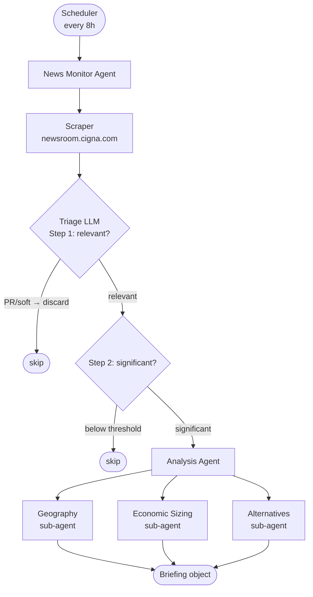
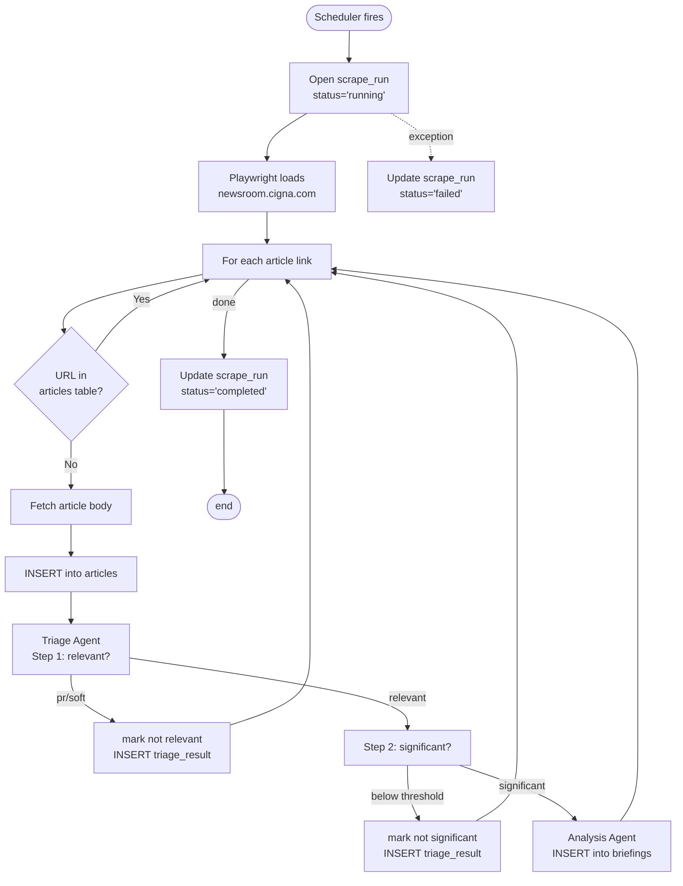

# Technical Design Document — Health Insurance News Agent

_Last updated: 2026-06-20_

---

## 1. System Overview

A Python-based hierarchical multi-agent pipeline built in two phases:

- **Phase 1 — Ingestion:** Scrapes `newsroom.cigna.com` every 8 hours and saves raw articles to PostgreSQL.
- **Phase 2 — Analysis:** Prompts triage and analysis agents against saved articles to extract structured intelligence.



---

## 2. Technology Stack

| Concern | Choice | Rationale |
|---------|--------|-----------|
| Language | Python 3.12 | Standard for LLM/agent work |
| Scraping (monitor) | requests + BeautifulSoup + feedparser | beckerspayer.com RSS feed is open; no JS rendering needed for regular runs |
| Scraping (backfill) | Playwright (chromium) | Article pages are behind Cloudflare; real browser required to fetch body text for historical articles |
| LLM | Anthropic Claude API | claude-haiku-4-5 for triage (cheap, fast); claude-sonnet-4-6 for analysis (quality) |
| Scheduling | APScheduler | In-process, no external cron dependency; simple to configure |
| Database | PostgreSQL (local Docker) | Already available; structured logging across runs |
| DB access | psycopg2 | Lightweight, no ORM needed at this scale |
| Prompt testing | Braintrust | Dataset management, structured output scoring, prompt versioning; articles are public so no data concerns |

---

## 3. Data Models

### 3.1 `scrape_runs`
Logs every scheduled execution.

```sql
CREATE TABLE scrape_runs (
    id              SERIAL PRIMARY KEY,
    source          TEXT NOT NULL,           -- RSS feed URL or backfill category listing URL
    started_at      TIMESTAMPTZ NOT NULL,
    completed_at    TIMESTAMPTZ,
    status          TEXT NOT NULL,           -- 'running' | 'completed' | 'failed'
    articles_found  INTEGER,                 -- total articles seen
    articles_new    INTEGER,                 -- articles not previously seen
    end_time        TIMESTAMPTZ,             -- timestamp when run reached completed or failed
    duration_secs   INTEGER,                 -- wall-clock seconds from started_at to end_time
    error_message   TEXT
);
```

### 3.2 `articles`
One row per discovered article URL. URL is the dedup key.

```sql
CREATE TABLE articles (
    id              SERIAL PRIMARY KEY,
    url             TEXT UNIQUE NOT NULL,
    title           TEXT,
    published_at    TIMESTAMPTZ,
    body_text       TEXT,
    source          TEXT NOT NULL,
    category        TEXT,                        -- RSS category tag; null for backfilled articles
    tags            TEXT[],                      -- all WordPress taxonomy terms from RSS feed (e.g. ['Payer', 'Medicare Advantage']); null for backfilled articles
    first_seen_at   TIMESTAMPTZ NOT NULL,
    scrape_run_id   INTEGER REFERENCES scrape_runs(id)
);
```

### 3.3 `triage_results`
Records the two-step LLM triage decision for each article.

```sql
CREATE TABLE triage_results (
    id                  SERIAL PRIMARY KEY,
    article_id          INTEGER UNIQUE REFERENCES articles(id),
    triaged_at          TIMESTAMPTZ NOT NULL,

    -- Step 1: relevance
    is_relevant         BOOLEAN NOT NULL,    -- false = PR/soft content, discard
    article_category    TEXT,                -- 'relationship' | 'business_change' | 'financial' | 'pr' | 'soft'

    -- Step 2: significance (only populated if is_relevant = true)
    is_significant      BOOLEAN,
    relationship_type   TEXT,                -- 'network_change' | 'acquisition' | 'termination' | 'tpa_shift' | 'provider_plan' | 'leading_indicator'
    estimated_members   INTEGER,             -- null if not estimable
    estimated_revenue_m NUMERIC,             -- millions of dollars, null if not estimable

    triage_reasoning    TEXT                 -- LLM's explanation of both decisions
);
```

### 3.4 `briefings`
Full analysis output for articles that passed both triage steps.

```sql
CREATE TABLE briefings (
    id                  SERIAL PRIMARY KEY,
    article_id          INTEGER UNIQUE REFERENCES articles(id),
    created_at          TIMESTAMPTZ NOT NULL,
    summary             TEXT NOT NULL,
    entities            JSONB NOT NULL,   -- [{name, role}]
    regions             JSONB NOT NULL,   -- [state/region strings]
    member_estimate     INTEGER,
    revenue_estimate_m  NUMERIC,
    sizing_reasoning    TEXT,
    alternatives        TEXT,
    raw_output          JSONB             -- full LLM response for debugging
);
```

---

## 4. Build Phases

### Phase 1 — Ingestion (build first)

Goal: a working scraper that populates `scrape_runs` and `articles` with no LLM involvement. Can be run and validated independently.

Deliverables:
- DB schema created in PostgreSQL
- Monitor scraper fetches articles from `beckerspayer.com` via RSS feed
- Backfill scraper walks the sitemap index and fetches article pages via Playwright
- Dedup logic prevents re-fetching known URLs
- Every run logged to `scrape_runs` with status and counts
- No triage or analysis — just raw storage

### Phase 2 — Prompt Development (build second)

Goal: design, test, and validate all prompts against real scraped articles before wiring them into the pipeline. Uses Braintrust.

Workflow:
1. Pull a sample of articles from the `articles` table
2. Hand-label them (relevant/not, significant/not, category, relationship type) to create a ground-truth dataset in Braintrust
3. Write and iterate on the triage prompt until it scores acceptably against the dataset
4. Repeat for each analysis sub-agent prompt (geography, economic sizing, alternatives)
5. Lock prompt versions before proceeding to Phase 3

Deliverables:
- Braintrust project set up with labeled dataset
- Validated triage prompt (relevance + significance in one call)
- Validated analysis prompts (one per sub-agent)
- Acceptable scoring threshold defined (TBD — e.g., ≥90% accuracy on relevance classification)

### Phase 3 — Analysis Pipeline (build third)

Goal: wire validated prompts from Phase 2 into the production agent pipeline.

Deliverables:
- Two-step triage agent writing to `triage_results`
- Analysis sub-agents (geography, economic sizing, alternatives) writing to `briefings`
- Scheduler wiring Phase 1 and Phase 3 together into the full 8-hour pipeline

---

## 5. Component Design

### 5.1 Scraper (Phase 1)

**Source: beckerspayer.com**
- Fetches RSS feed at `/feed/` with `feedparser` — returns full article HTML in `content:encoded`
- No Playwright needed; the feed is not behind Cloudflare
- No backfill support: `?paged=N` is blocked (403), so only the current feed window (~10 items) is available. Ongoing monitoring is fine since the 8-hour schedule catches new articles before they scroll off.
- Article body is extracted from the `content:encoded` field directly — no second HTTP request needed per article; strip HTML tags before storing

**Backfill (category listing pages + CDP):**
- Category listing page URLs (e.g. `https://www.beckerspayer.com/executive-moves/`) are loaded from config
- Each listing page is fetched with plain `requests` (not Cloudflare-blocked) and parsed for article URLs + publish dates
- Articles older than the configured cutoff date are skipped before any browser session is opened
- Pagination follows `/page/2/`, `/page/3/`, etc.; stops when all articles on a page are older than the cutoff
- URLs already in `articles` are skipped on the listing page — no CDP fetch for known URLs
- New article pages are loaded via Chrome CDP (headed Chrome required — headless Playwright is Cloudflare-blocked)
- Extracts title from `article h1`, date from `<time datetime>`, body from `.entry-content`, tags from `NewsArticle` JSON-LD `keywords`
- Reuses a single browser session across all fetches; adds a short delay between page loads

**Dedup logic:** Before processing an article, check `SELECT 1 FROM articles WHERE url = $1`. If it exists, skip it entirely — no LLM call, no re-processing.

### 5.2 Triage Agent (Phase 2)

Model: `claude-haiku-4-5` (fast and cheap — runs on every new article)

Input: article title + body text

**Two-step triage in a single LLM call:**

**Step 1 — Relevance:** Is this article about a relationship change, business change, or financial development — or is it generic PR content or a soft qualitative story?

- Relevant categories: `relationship`, `business_change`, `financial`
- Discard categories: `pr` (press releases, awards, sponsorships, community news), `soft` (opinion, qualitative trends with no named parties or dollar figures)
- If `is_relevant = false`, stop. Do not proceed to Step 2.

**Step 2 — Significance:** Does this story meet the threshold?
- Estimate member count and revenue impact from article text
- Flag as significant if estimated members ≥ 1,000 OR estimated revenue ≥ $1M
- Identify relationship type if applicable

Output: structured JSON written to `triage_results`

```json
{
  "is_relevant": true,
  "article_category": "relationship",
  "is_significant": true,
  "relationship_type": "network_change",
  "estimated_members": 45000,
  "estimated_revenue_m": 120.0,
  "triage_reasoning": "Article describes Cigna terminating its contract with..."
}
```

### 5.3 Analysis Agent (Phase 2)

Model: `claude-sonnet-4-6` (quality — runs only on flagged articles)

Triggered when `is_relevant = true` AND `is_significant = true`. Three focused sub-calls:

**Sub-agent 1 — Geography**
- Input: article text
- Output: list of affected states/regions

**Sub-agent 2 — Economic Sizing**
- Input: article text + triage estimates as prior
- Output: refined member count, revenue estimate, sizing reasoning

**Sub-agent 3 — Alternatives**
- Input: article text + entities + regions
- Output: narrative describing options available to affected parties

Results assembled into a `briefings` row.

### 5.4 Scheduler (Phase 2)

APScheduler with an `IntervalTrigger` set to 8 hours. On startup, runs immediately if no prior completed run exists within the last 8 hours.

```python
scheduler.add_job(run_monitor, 'interval', hours=8, next_run_time=datetime.now())
```

---

## 6. Processing Flow



---

## 7. Project Structure

```
health-insurance-news-agent/
├── agent/
│   ├── scraper.py          # Playwright scraping logic (Phase 1)
│   ├── triage.py           # Two-step triage LLM agent (Phase 2)
│   ├── analysis.py         # Analysis sub-agents (Phase 2)
│   └── briefing.py         # Assembles briefing from sub-agent outputs (Phase 2)
├── db/
│   ├── connection.py       # psycopg2 connection pool
│   └── schema.sql          # All CREATE TABLE statements
├── scheduler.py            # APScheduler entry point (Phase 2)
├── config.py               # ENV vars (DB URL, API key, schedule interval)
├── requirements.txt
└── tests/
```

---

## 8. Testing

Unit tests cover Phase 1 scraper code. Prompt quality is evaluated separately via Braintrust (Phase 2) — these are distinct concerns and should not be conflated. No unit test should hit a live HTTP endpoint or a live database. HTTP is mocked with fixture files and the `responses` library; the DB layer is mocked with `unittest.mock`.

**Test names are behavioral specs.** A test name should state the expected outcome and the condition under which it holds — not describe the test setup. Pattern: `test_<function>_<expected outcome>_<when condition>`. Example: `test_already_seen_returns_true_when_url_exists_in_db`. Reading the full test suite by name should read like a specification of the system.

**Write tests before code.** Specs are written as plain English behavioral statements first, then translated into declaratively-named tests, then code is written to make them pass. Tests written after code are observations, not specs.

---

## 9. Configuration (Environment Variables)

| Variable | Description |
|----------|-------------|
| `ANTHROPIC_API_KEY` | Claude API key |
| `DATABASE_URL` | PostgreSQL connection string |
| `MONITOR_INTERVAL_HOURS` | Scrape interval (default: 8) |

---

## 10. Open Questions

| # | Question | Why it matters |
|---|----------|----------------|
| Q1 | How are briefings delivered to Eric? | Determines what happens after a briefing row is written — email, Slack, file output, etc. Deferred from PRD. |
| Q2 | Should the scheduler persist its next-run time in the DB? | If the process restarts mid-interval, does it resume from the original schedule or run immediately? |

---

## Appendix A — beckerspayer.com Technical Reference

Everything known about the Becker's Payer site as of 2026-06-21. Update this section when new findings change the scraping approach.

### A.1 Site Structure

Becker's Payer is one of several sites in the Becker's Healthcare network. It is editorially focused on health insurance payers: contracting, network changes, M&A, reimbursement, and policy.

**Top-level navigation sections and their categories:**

| Section | Categories |
|---------|-----------|
| Strategy | Financial, Legal, M&A, Payer Issues, Rankings & Ratings, Virtual Care |
| Leadership & Workforce | Executive Moves, Leadership, Workforce |
| Policy | Contracting, Policy Updates, Research & Analysis |

**URL patterns:**
- Category article: `/category/article-slug/`
- Tagged article: `/category/tag/article-slug/`

**Tags (WordPress tags, not sub-categories):** Found within Payer Issues: `medicare-advantage`, `medicaid`, `aca`. An article can carry multiple tags. Other categories (e.g., Financial, Contracting) have no observed tags — articles go directly to `/category/article-slug/`.

**Publish rate:** ~5 articles/day across all categories.

---

### A.2 RSS Feed

| Property | Value |
|----------|-------|
| URL | `https://www.beckerspayer.com/feed/` |
| Items returned | 10 (fixed) |
| Body content | Full article HTML in `content:encoded` — no second HTTP request needed |
| Cloudflare | Not blocked |
| Feed window | ~2 days at current publish rate |

**Category/tag feeds** (e.g., `/payer/feed/`, `/contracting/feed/`) return **403** — Cloudflare blocks all sub-path feeds.

**Query parameters** to expand item count (e.g., `?posts_per_page=50`, `?count=50`) also return **403** — any query string on the feed URL is blocked.

---

### A.3 Article Pages

| Property | Value |
|----------|-------|
| Direct HTTP fetch | **403** — Cloudflare blocks all article page requests |
| Headed Chrome | Accessible — Cloudflare passes real browser sessions |
| Body selector | `.entry-content` |
| Title selector | `article h1` |
| Date | `<time>` element; `datetime` attribute preferred, fallback to `innerText` |
| Tags | Not visible in the UI — only "Legal" or similar section label is shown. Full tag set is in the `keywords` field of the `NewsArticle` JSON-LD block (`<script type="application/ld+json">`). Tags are lowercase in JSON-LD vs mixed case in the RSS feed. |

---

### A.4 Sitemap

| Property | Value |
|----------|-------|
| Index URL | `https://www.beckerspayer.com/sitemap_index.xml` |
| Cloudflare | Not blocked |
| Post sitemaps | 16 files: `post-sitemap1.xml` through `post-sitemap16.xml` |
| Coverage | 2013 to present |
| Fields per entry | `<loc>` (URL), `<lastmod>` (date) |

Post sitemap files are accessible via plain `requests`. Each contains `<loc>` and `<lastmod>` for every article — sufficient for date-filtered backfill without fetching article pages.

---

### A.5 Backfill

Pagination on the RSS feed is blocked (see A.2). The backfill path uses category listing pages instead:

1. Load category listing page URLs from config (e.g. `/executive-moves/`, `/contracting/`)
2. Fetch each listing page with plain `requests` — not Cloudflare-blocked
3. Parse article URLs and publish dates from each listing entry
4. Skip articles older than the cutoff date and URLs already in `articles` — no CDP fetch needed
5. Paginate through `/page/N/` until cutoff is reached or no more pages exist
6. Fetch qualifying article pages using **Chrome CDP** — headless Playwright/Chromium is detected and blocked by Cloudflare; only a real Chrome session passes

**Listing page date formats** (three formats observed in the wild):
- Recent: `Jun 22, 2026, 12:44 PM PDT`
- Older: `Tuesday, June 9th, 2026`
- Very recent: `2 hours ago`

**CDP setup (required for backfill):** Quit Chrome, then launch with:
```
open -a "Google Chrome" --args --remote-debugging-port=9222
```
The scraper connects via `playwright.chromium.connect_over_cdp("http://localhost:9222")` and reuses the existing browser session.
